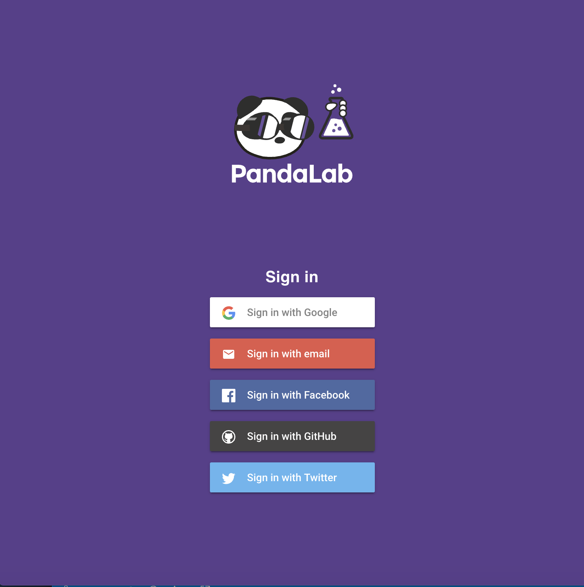
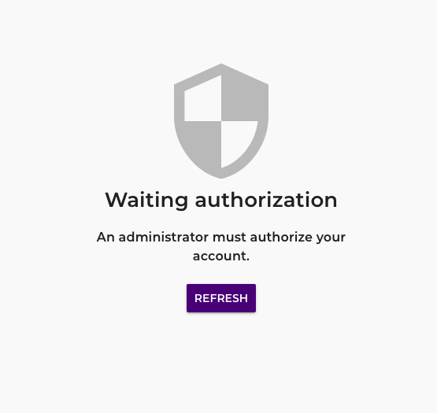

# Identity providers

Firebase Authentication allows you to connect to multiple providers :

* google.com (OAuth Google)
* password (Email)
* facebook.com (OAuth Facebook)
* github.com (OAuth Github)
* twitter.com (OAuth twitter)



--- 

## Configure the list of providers

The different providers are configurable in the file`.config/config.json` : 

```json
{
 // ...
 "authProviders": [
     "google.com",
     "password",
     "facebook.com",
     "github.com",
     "twitter.com"
 ]
}
```

The `authProviders` property is an array with the different providers. You are free to use those you need.

Don't forget to configure each of them in the Firebase console.


The configuration of the different providers in firebase is available on the [official documentation](https://firebase.google.com/docs/auth)


## Role

PandaLab use different user role : 
* guest
* user
* admin

#### Security

_The first user created in the application will be automatically admin. 
Then the following will be identified as a guest until the administrator grants rights greater than this one._



